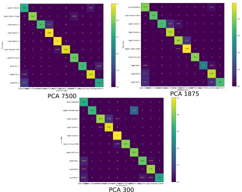
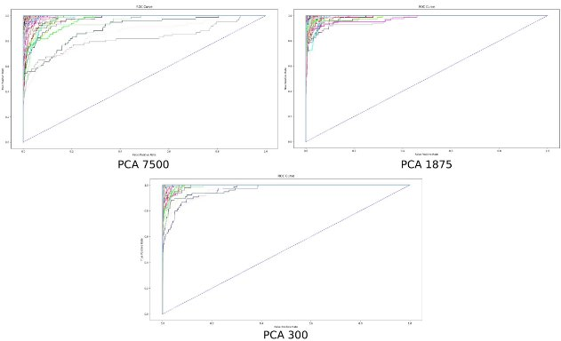

Introduction

Motivation

This repository represents the semester project for the Computational Intelligence 1 class. In the past decades, bad eating habits have started to become the norm for a majority of the population, as the quality of the food became worse and worse thanks to the automation of the acquiring and processing of the aliments. Easy to process, but bad quality, food became cheaper and available to larger masses, while qualitative food became almost a privilege. Junk food posses a serious threat to our health, leading to obesity, higher risk of heart attacks, diabetes, etc.

The motivation behind realising a Fruit Classier was to make a system which would help people eat healthier, by trying out and discovering dierent types of fruit and vegetables, and the farmers to eciently sort and pick fruits.

Objectives

This project aims to achieve the following objectives:

- Analyzing the provided dataset, in order to gain an understanding of the data for a suitable approach to the problem;
- Applying die rent types of Principal Component Analysis transforms to the data, with the goal of studying the eects of using fewer and fewer components to train the network;
- Implementing and training of Multilayer Perceptron models.

Applicability

This project has a great potential in many day to day applications, some of which include:

- Grocery stores : A Fruit Classier could be used to help customers identify dieren t types of fruit and provide information about their nutritional content, origin, and other relevant details;
- Restaurants : Fruit Classiers could be used by chefs and kitchen sta to quickly and accurately identify dierent types of fruit for use in recipes or for creating fruit platters and other dishes;
- Agriculture : A Fruit Classier could be used by farmers and agricultural workers to sort and classify dierent types of fruit, which could lead to more ecient and sustainable farming practices;
- Food processing : Fruit Classiers could be used in food processing facilities to sort and classify dierent types of fruit for use in various products, such as juices, jams, and baked goods;
- Health and wellness : A Fruit Classier could be used as a tool to help people make healthier food choices and encourage them to eat a diverse range of fruit.

EXPERIMENTAL SETUP

The implementation was realised in the Python programming language, using specialised libraries, such as NumPy for mathematical operations, Scikit-image for image processing func- tions, Sklearn for Principal Component Analysis, TensorFlow, Keras and Pytorch for the Multilayer Perceptron, etc.

1. Dataset

The dataset used for the task of Fruit Classication is called Fruits 360 [^1][.](#_page22_x78.90_y774.38) It is a vast dataset, containing 90483 images of 131 classes of fruits and vegetables, split between 67692 for training and 22688 for testing. The images are in RGB format and have the size of 100x100 pixels, as shown in Figure [1.1](#_page23_x57.83_y50.60).

In order to make the dataset, fruits and vegetables were planted in the shaft of a low-speed motor (3 rpm) and a short movie of 20 seconds was recorded. A Logitech C920 camera was used for lming the fruits. Behind the fruits, the authors placed a white sheet of paper as a background.

However, due to the variations in the lighting conditions, the background was not uniform and so the authors wrote a dedicated algorithm that extracts the fruit from the background. This algorithm is of ood ll type: it starts from each edge of the image and it marks all pixels there, then it marks all pixels found in the neighborhood of the already marked pixels for which the distance between colors is less than a prescribed value. The previous step was repeated until no more pixels could be marked.

All marked pixels are considered as being background (which is then lled with white) and the rest of the pixels are considered as belonging to the object.

The maximum value for the distance between 2 neighbor pixels is a parameter of the algo- rithm and is set (by trial and error) for each movie.

Figure 1.1: Examples of dataset images

2. Implementation

As a preprocessing step, the PCA transform matrix was computed on all of the training set images, and then applied to every element of the dataset. Three PCA matrices were extracted, one with 7500 (50 x 50 x 3) components, another with 1950 (25 x 25 x 3) components and the last with 300 components (10 x 10 x 3). In Figures [1.3, ](#_page24_x57.83_y493.96)[1.4](#_page24_x57.83_y644.97) and [1.5](#_page25_x57.83_y642.51) are depicted one of the images of the dataset, with its new transformed representation and the reconstructed image for every PCA matrix, while in Table [1.1](#_page23_x57.83_y531.80) the percentage of components kept and the information conservation factor for each one of the three PCA matrices are shown.

|Number of components|Percentage of components|Information conservation factor|
| - | - | - |
|7500|25%|99.875%|
|1875|6.5%|98.931%|
|300|1%|95.512%|
Table 1.1: Component percentages and information conservation factors for every PCA matrix

After that, before entering the network, every image was attened and normalized in the [0, 1] interval, as not to cause overtting. If the values would have been left unaltered, in [0, 255], the elements that have a large value may be associated to large weights by the network (the model associates a higher numerical value to a higher importance for that specic piece of data) and that may be detrimental to the learning process.

The labels were encoded using the One Hot Encoding method, as it is desired for the network to predict the probabilities of an image belonging to each class. A One Hot vector is a sparse

vector where every value is 0, except at the index of the respective class, where the value is 1.

The network used for this Fruit Classication task was a simple MLP with 6 hidden layers, having its architecture depicted in Figure [1.2](#_page24_x57.83_y326.10). The input layer has a size equal to that of a input vector. The rst hidden layer contains 1024 neurons, the next 3 have 512 neurons and the latter 2 hidden layers contain 256 neurons. All the hidden layers use ReLU as the activation function. The output layer contains 131 neurons, equal to the total number of classes, and makes use of the Softmax activation function in order to predict the probabilities for an input vectors to belong to each class.

The model was trained for 150 epochs without PCA and for around 50 epochs with PCA, with Categorical Cross-Entropy as the loss function and ADAM as the optimizer, with a learning rate of 0.001 and a batch size of 512. Half of the testing set was used as a validation set during training.

Figure 1.2: Architecture of the Multilayer Perceptron model

Figure 1.3: PCA with 7500 components

Figure 1.4: PCA with 1875 components

Figure 1.5: PCA with 300 components

RESULTS

1. Without PCA

For the training of the MLP without PCA, an accuracy of 92.60% and a loss of 0.4 were obtained on the testing set. The lowest per-class accuracy was obtained for "Corn" (45.33%), while 100% accuracy was obtained for multiple classes. In Figure [2.1](#_page26_x57.83_y378.13) are depicted the loss and accuracy curves for this model.

Figure 2.1: Accuracy and loss evolution during the training of the MLP without PCA, for

training and validation sets

In Figures [2.2 ](#_page27_x57.83_y50.60)and [2.3 ](#_page28_x57.83_y50.60)are depicted the Confusion Matrix for the rst ten classes and the ROC curve for the model.

A Confusion Matrix is a table that is used to evaluate the performance of a classication algorithm. It is a summary of prediction results on a classication problem. The number of correct and incorrect predictions are summarized with percentages and broken down by each class. This allows us to see which classes are being predicted accurately and which are not. Each row of the matrix represents the instances in a true class, while each column represents the instances in a predicted class. The values on the main diagonal of the matrix represent the fraction of instances that were correctly classied. The values o the main diagonal represent the fraction of instances that were misclassied.

Figure 3.2: Fraction of the Confusion Matrix for the rst 10 classes, for the model trained

without PCA applied

A Receiver Operating Characteristic (ROC) curve is a graphical plot that illustrates the performance of a binary classier system as its discrimination threshold is varied. The curve is created by plotting the True Positive Rate (TPR) against the False Positive Rate (FPR) at various classication thresholds. The true positive rate is dened as the number of true positive results divided by the total number of positive results, while the false positive rate is dened as the number of false positive results divided by the total number of negative results.

The ROC curve is a useful tool for comparing the performance of dierent classier models, as well as for selecting the optimal model for a particular problem. A classier that produces a ROC curve that is closer to the top-left corner of the plot is considered to be more accurate than a classier that produces a ROC curve that is closer to the diagonal line.

An ideal classier would produce an ROC curve that is a step function with a true positive rate of 1 and a false positive rate of 0. This would indicate that the classier is able to perfectly distinguish between the positive and negative classes. In practice, however, most classiers produce ROC curves that are less than ideal, and the trade-o between true positive rate and false positive rate must be considered when selecting a classier for a particular problem.

In multi-class classication, the ROC curve is typically constructed by rst converting the

multi-class problem into a binary classication problem, and then applying the methods used for constructing an ROC curve for binary classication. One way to do this is to use the One- versus-All (OvA) approach, where a separate binary classier is trained for each class, and the classier is trained to distinguish that class from all of the other classes. The ROC curve for each class is then plotted and the resulting curves are combined to create the multi-class ROC curve.

Figure 2.3: Receiver Operating Characteristic curve for the model trained without PCA applied

2. With PCA

For the training of the MLP with PCA, the accuracies and losses of the three models are shown in Table [2.1](#_page28_x57.83_y615.24). In Figures [2.4](#_page29_x57.83_y60.82), [2.5](#_page29_x57.83_y307.63) and [2.6](#_page29_x57.83_y552.81) are depicted the loss curves and accuracy curves for these models, while in Figures [2.7](#_page30_x57.83_y70.43) and [2.8](#_page30_x57.83_y446.88) are depicted the Confusion Matrices for the rst ten classes and the ROC curves.

As expected, the model trained without PCA applied had the best accuracy and loss function value from the 4 models trained, because the MLP had every piece of information available about the data, whereas with PCA applied a small part of the information about the images is lost and so the performance is a little worse. What is interesting about the models where PCA was applied is that, as fewer components are used, the performance of the classier improves. We suspect the reason for this is that, as fewer and fewer components are used, the network has to deal with less redundant information (for example, between 300 components and 7500 components there is only a dierence of about 3% of the total amount of information in more than 20 times the number components) and so it is less prone to mistakes. However, the advantage of PCA is that it allows for faster training of the Neural Network models, as the input data has a lower dimensionality fewer weights are required for the connections in the network and thus vastly improving the computational speed.

|Number of components|Accuracy|Loss|
| - | - | - |
|7500|84.37%|0.98|
|1875|88.24%|0.63|
|300|90.82%|0.54|
Table 2.1: Performance of the three MLP models trained with PCA

Figure 2.4: Accuracy and loss evolution during the training of the MLP with PCA with 7500

components, for training and validation sets

Figure 2.5: Accuracy and loss evolution during the training of the MLP with PCA with 1875

components, for training and validation sets

Figure 2.6: Accuracy and loss evolution during the training of the MLP with PCA with 300

components, for training and validation sets

Figure 2.7: Fraction of the Confusion Matrix for the rst 10 classes, for the 3 models trained

with PCA

Figure 2.8: Receiver Operating Characteristic curve for the 3 models trained with PCA

CONCLUSIONS

1. General conclusions

This project represents a Fruit Classier, capable of labeling dierent kinds of fruits and vegetables using a simple MLP model with 6 hidden layers. This type of system has a great applicability in the food industry, potentially saving time and eort in tasks such as sorting or inventory management.

In Chapter [1 ](#_page12_x57.83_y57.83)was presented a theoretical overview on Neural Networks, Multilayer Percep- tron and Principal Component Analysis.

Chapter [2 ](#_page22_x57.83_y57.83)depicts the implementation process, from the dataset, a few preprocessing steps and the architecture and hyperparameters of the model.

Chapter [3 ](#_page26_x57.83_y57.83)presents the results obtained and the performance of the trained models, as well as the eects that PCA has on the training process.

2. Personal contributions
- Analyzing the dataset, in order to gain an understanding of the data for for a suitable approach to the problem;
- Applying dieren t types of PCA transforms to the data, with the goal of studying the eects of using fewer and fewer components to train the network;
- Implementing and training of the MLP models.

The source code of the project implementation is available on Github[^2].

3. Future developments

In general, the most important thing when implementing a Neural Network model is the available data for training. The rst future development would be the extension of the dataset by dierent techniques of data augmentation, in order to greatly multiply our data.

Another development would be the implementation of a Convolutional Neural Network (CNN) architecture, as these types of network specialise in processing images using convolution and pooling operations and have less parameters than regular networks, which allows for a faster training process and more experiments to be run.

BIBLIOGRAPHY

1. Tomasz Szanda la. Review and Comparison of Commonly Used Activation Functions for Deep Neural Networks, pages 203{224. Springer Singapore, Singapore, 2021.
1. Sebastian Ruder. An overview of gradient descent optimization algorithms. arXiv preprint arXiv:1609.04747, 2016.
1. Diederik P Kingma and Jimmy Ba. Adam: A method for stochastic optimization. arXiv preprint arXiv:1412.6980, 2014.
26

[^1]: <https://www.kaggle.com/datasets/moltean/fruits>
[^2]: <https://github.com/Cata400/fruit_classification>